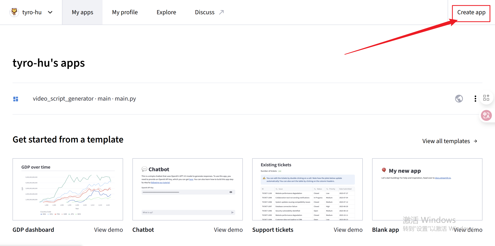
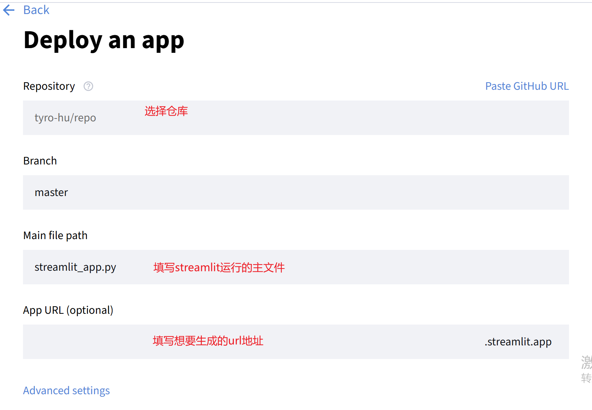

## 使用https://share.streamlit.io/ 也叫Streamlit Community Cloud部署streamlit应用
1. 准备github代码仓库（上传项目，项目中包含requirements.txt文件）
2. 打开 https://share.streamlit.io 并登录
3. 点击create app 
4. 选择从github仓库中创建应用 
5. 填写部署信息 
6. 点击部署应用
