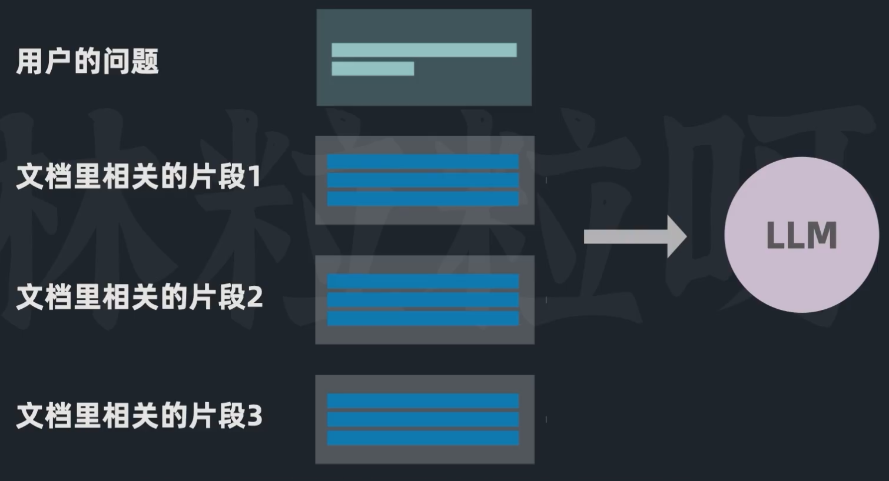
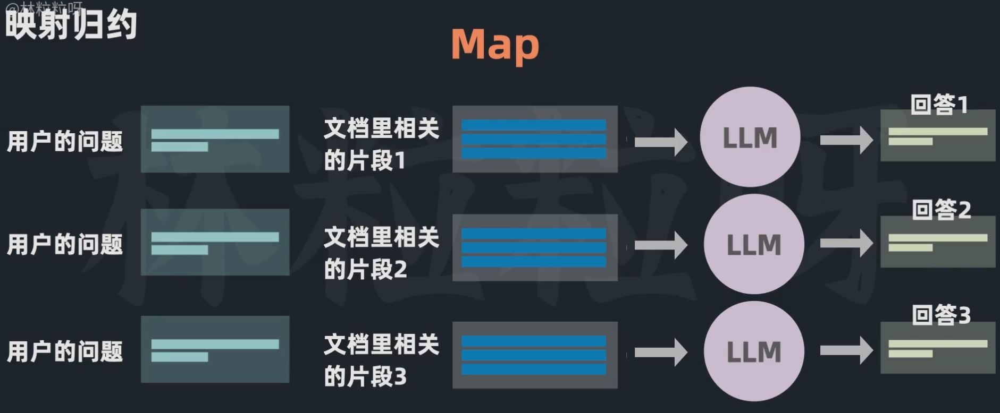
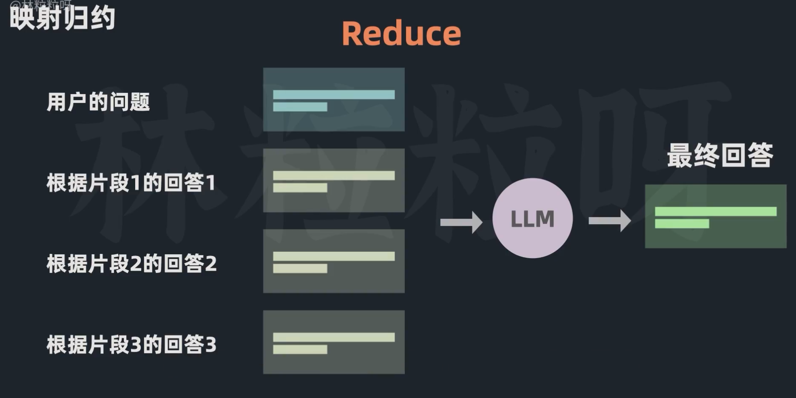
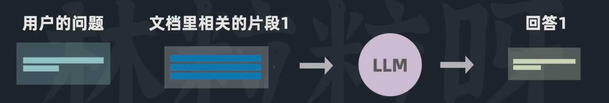
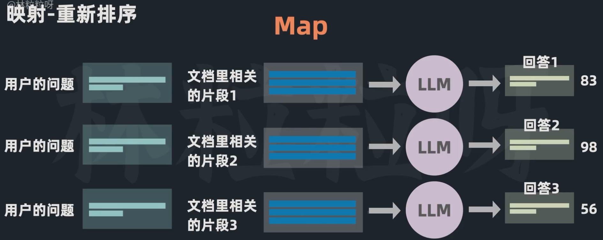
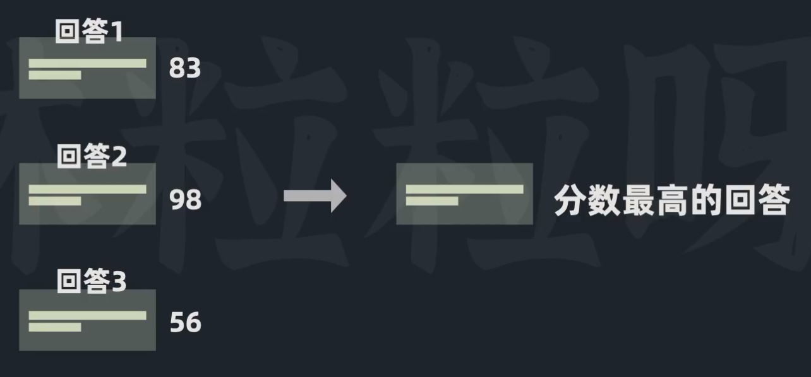

## 把外部文档塞给模型的不同方式
1. Stuff 填充

优点：模型可以一次性看到所有的相关信息。
缺点：片段很长，或者相关性片段很多的情况下，可能会超过模型的上下文窗口。

2. Map-Reduce 映射-归约
   1. Map阶段
    每个相关片段会单独传递给模型，让模型根据各个片段，对查询分别作出回答。
    
   2. Reduce阶段
    将各个片段的回答进行汇总，作为输入传递给模型。
    
优点：可以处理长文档，或者相关性片段很多的情况。在无法将文本全部传给模型的情况下，可以有效融合来自多个来源的信息。
缺点：需要多次调用模型，效率较低。BAAI/bge-small-en

3. Refine 优化
    1. 从第一个片段开始，得到模型的回答。
    
    2. 将上一个回答，查询以及第二个片段一起传递给模型，让模型对回答进行优化。
    
    3. 重复步骤2，直到所有片段都处理完毕。
优点:根据新的信息，不断优化回答。
缺点：需要多次调用模型，效率较低。

4. Map-Rerank 映射-重排
   1. Map阶段：同2中的Map阶段。这里不仅要回答，模型还要评估各个片段对生成准确回答的贡献度。
   
   2. Rerank阶段：找出最高得分的回答作为最终的回答。
    
优点：解决相关文档过多，或者过长的问题。
缺点：不会整合不同片段之间的信息。

代码：创造ConverseChatChain.from_llm时，并设置相关参数chain_type="stuff"/"map_reduce"/"refine"/"map_rerank"。默认是"stuff"。